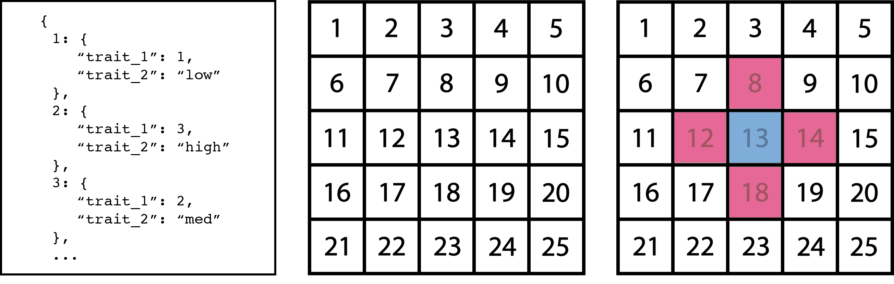
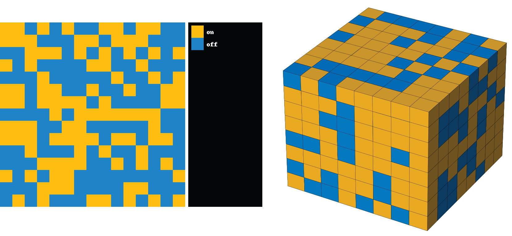

# Summary

`pylattica` provides a simple and flexible framework for prototyping lattice-based simulations such as atomistic Monte Carlo simulations or cellular automata. It is differentiated from other lattice simulation packages by i) its agnosticism toward the form of the update rule, simulation structure, neighborhood structure, and simulation state and ii) its interoperability with the `pymatgen` package which allows modeling of arbitrary crystalline systems (i.e. not only two or three dimensional square grids), and makes it particularly well suited to applications in materials science and chemistry.

# Statement of need

Cellular automata [@bays_introduction_2010], lattice-gas automata [@boghosian_lattice_1999], and atomistic Monte Carlo models [@andersen_practical_2019] are all simulations in which a system, represented by an arrangement of connected sites, evolves over time according to an update rule which determines the future state of a site by considering its current state and the state of each of its neighbors. For example, in the classic "Game of Life" cellular automaton [@gardner_mathematical_1970], sites in a 2D square grid switch between "dead" and "alive" during each timestep based on the number of living neighbors surrounding them. In lattice Monte Carlo simulations for vacancy diffusion in crystalline solid materials, atoms move between neighboring sites at rates partially determined by the occupancy of their neighbors [@haley_vacancy_2006].

These simulation classes have been implemented many times in various programming languages for a range of applications [@andersen_practical_2019; @raabe_cellular_2002]. However, these implementations typically focus on tuning an existing simulation form within a relatively narrow range of focus. For instance, `CellPyLib` [@antunes_cellpylib_2023], `netomaton` [@antunes_netomaton_2019], and `cellular_automaton` [@feistenauer_cellular_automaton_2021] are all libraries for simulating cellular automata, but they each are limited in the simulation geometry, the data type for the simulation state, the geometry of the neighborhood, or the strategy for applying the update rule. Similarly, `lattice_mc` [@Morgan2017] is an excellent Monte Carlo program that focuses solely on diffusion in ionic solids. While `KMCLib` [@leetmaa_kmclib_2014] is a more generic alternative, it is still (appropriately) limited in the form of the state and the update rule.

The goal of `pylattica` is to synthesize the essential elements of these valuable simulation classes into a flexible and user-friendly framework for developing lattice models that do not fit neatly into the target use case of one of the existing packages. It accomplishes this by providing implementations of common lattice model features (e.g. various neighborhoods, methods for applying evolution rules, simulation structures, and analysis tools) while remaining unopinionated with regard to the ways these pieces are used in new models. It is implemented in python to maximize accessibility and interoperability with other scientific software tools, in particular, `pymatgen`, a package containing utilities for analysis in materials science [@ong_python_2013].

Because `pylattica` is particularly focused on enabling fast iteration on simulation features during development, it prioritizes flexibility and application agnosticism over performance. Therefore, it is most appropriately used in cases when the developer needs to prototype and experiment with various forms of their model, or in cases when performance is not of the utmost importance.

# Package Overview

## Simulation representation

In lattice models, a system is represented by a network of connected sites, frequently a two or three dimensional square grid, with some state value assigned to each site. In `pylattica`, this representation is accomplished by the combination of three entities, which separate the dominant concerns (illustrated schematically in \autoref{fig_1}):

- A `Structure`, which enumerates the sites and their physical locations with no limitations on periodicity or dimensionality
- A `SimulationState`, which acts as an index of sites and stores the state of each site as an arbitrary key-value mapping
- A `Neighborhood`, which encodes the connectedness of the sites

Of these three entities, only a `SimulationState` is required to run a simulation. The user can freely utilize `Structure`s and `Neighborhood`s as required by their use case in the preparation or evolution of the system.

## Constructing Neighborhoods

`pylattica` supports two and three dimensional square grid simulation structures out of the box (though any simulation structure can be created), and provides convenience methods for building them. Additionally, it provides a number of `NeighborhoodBuilder` classes which encode methods for specifying site neighbors in `Structure`s. The two most flexible `NeighborhoodBuilder` classes are the `DistanceNeighborhoodBuilder` and the `MotifNeighborhoodBuilder`. Using the `DistanceNeighborhoodBuilder`, the neighbors of a site are defined as all other sites falling within a particular cutoff distance. Using the `MotifNeighborhoodBuilder`, the locations of a site's neighbors are specified by providing a list of offset vectors from that site (one for each neighbor). While these two classes can be used to construct practically any neighborhood, builder classes for the following common neighborhoods are also provided:

- Moore (square grid) [@packard_two-dimensional_1985]
- Von Neumann (square grid) [@packard_two-dimensional_1985]
- Pseudopentagonal (square grid) [@sieradzki_perceptive_2013]
- Pseudohexagonal (square grid) [@sieradzki_perceptive_2013]
- Annular (arbitrary structure)

## Simulation Execution

Running a simulation entails applying an “update rule” to sites in the simulation. `pylattica` only requires that the update rule accept a site identifier and the current simulation state as input and provide a collection of intended state changes as output. This rule is implemented by the user in the `get_state_update` method on a `Controller` class. In most cases, a `Neighborhood` object will be used to consider the state of neighboring sites when calculating the intended changes, though this is not required. The flexibility provided by this arrangement makes it straightforward to iterate on the definition of the rule while developing a simulation.

The simulation is evolved by providing the `Controller` and a desired number of steps to an instance of the `Runner` class. The `Runner` passes sites to the `Controller`, and keeps track of updates as they are returned and accumulated over the course of the simulation. Two modes of evolution are supported by `pylattica` [@fates_guided_2013]:

- Synchronous - at each simulation step, the rule is applied to every site
- Asynchronous - at each simulation step, the rule is applied to a single random site

The result of a simulation run is an instance of `SimulationResult`, which stores the state at every step in the simulation as a list of `SimulationState`s. It can be easily serialized for storage on a filesystem or a document store, like MongoDB.

## Visualization and Analysis

`pylattica` provides basic utilities for analyzing the state of the simulation. These tools provide functionality for filtering and counting sites in a SimulationStep by arbitrary criteria (implemented as a function of the site’s state). Further specialized support is provided for simulation states in which the state of each site is a single discrete label (as is the case in traditional cellular automata).

In the case of simulations with two- and three-dimensional square grid structures, `pylattica` provides visualization tools which convert `SimulationState`s into PNG images (as shown in \autoref{fig_2}) and `SimulationResult`s into animated GIFs.

## Crystal Structure Support and pymatgen

`pylattica` was developed with simulations of crystalline materials in mind. As a result, it supports simulation `Structure`s defined with periodic boundaries and lattices with arbitrarily shaped unit cells. In service of developing simulations of real crystalline materials, it provides utility functions for defining neighborhoods in periodic space based on displacement motifs (e.g. octahedral or tetrahedral neighbors) and supports converting `pymatgen.Structure` objects to `pylattica` `Structure`s. This feature is intended to enable more seamless integration with existing materials science workflows.

# Acknowledgments

This work was primarily funded and intellectually led by the Materials Project, which is funded by the U.S. Department of Energy, Office of Science, Office of Basic Energy Sciences, Materials Sciences and Engineering Division, under Contract no. DE-AC02-05-CH11231: Materials Project program KC23MP. It also received support from the U.S. Department of Energy, Office of Science, Office of Basic Energy Sciences, Materials Sciences and Engineering Division, under Contract No. DE-AC02-05CH11231 within the Data Science for Data-Driven Synthesis Science grant (KCD2S2). MCG acknowledges Matthew J. McDermott and Bryant Li for useful discussions during the development of this work. 